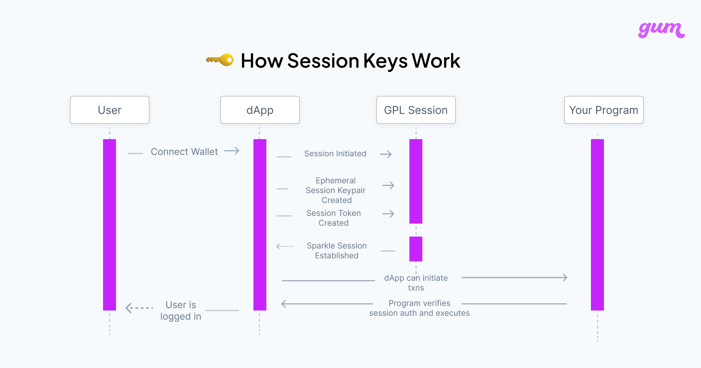

# 🔑 How do Session Keys work?

Session Keys are meant to be used as secondary signers in your program, especially for frequent interactions like liking a post or moving a piece in a game of chess where constant popups can get in the way of smooth user experience. **They are not burner wallets**.&#x20;

Session Keys work in tandem with our on chain program to validate the token and it's scope.

## **Session Keys have two components**

1. An **Ephemeral Keypair**, intended to be used as a **secondary signer** in the target program.
2. A **Session Token**, a PDA containing information about **expiry and scope** of the keypair.

## **How do they work?**

<figure><figcaption></figcaption></figure>

* Ephemeral Keys are stored on the client side, to invoke transactions.
* The transactions invoked by these ephemeral keys are validated in the target program for their validity, expiry and scope.
* Every transaction needs to present both the ephemeral signer and the session token
* This is the general idea behind _account abstraction_, where **instead of just an externally owned key there is also smart contract that enhances security**.

## **Key Management**&#x20;

Key Management is an extremely important aspect of the security. One thing to note here however is that how securely one can manage the keys is platform dependent, for example a mobile app with access to local keystore/keychain is a lot more secure compared to a web browser.\
\
Our current client side key management is only on the web. Given the constraints, we do take adequate security measures on the browser. \
\
The ephemeral keypair is encrypted and safely stored in the user's browser using IndexedDB, an in-browser database. When a user initiates an action, such as signing and sending a transaction, the session token signs the transaction using the temporary key pair. The smart contract can then validate the transaction, confirming that the user's wallet authorized the session token.\

1. Generate a random keypair using `web3.Keypair.generate()`
2. Generate a random encryption key
3. Using the encryption key encrypt the generated keypair.
4. Store the encrypted key in IndexedDB
